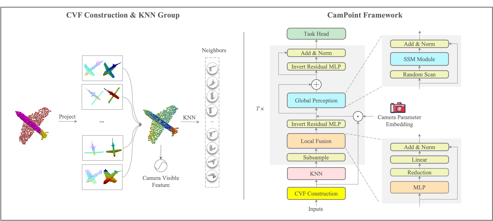

# CamPoint :camera:

This repository is the official implementation of the paper:

**[\[CVPR 2025\] CamPoint: Boosting Point Cloud Segmentation with Virtual Camera](https://openaccess.thecvf.com/content/CVPR2025/papers/Zhang_CamPoint_Boosting_Point_Cloud_Segmentation_with_Virtual_Camera_CVPR_2025_paper.pdf)**.

> TL;DR: The ***CamPoint*** employs **Camera Visibility Feature(CVF)** to encode points as feature vector via virtual cameras, representing the visibility from multiple camera views. Mainly works include:
> - **Camera Perspective Slice Distance(CPSD)**: Identifies semantically related neighbors rather than just spatially closest points to enhance local feature aggregation.
> - **Camera Parameter Embedding(CPE)**: Integrates camera prior features into point representations to enhance global information perception.
> 
> The CamPoint achieves SOTA performance on multiple datasets (e.g., 83.3% mIoU on S3DIS, without any spacial strategies like voting, pre-training, or joint training), with fewer parameters, lower training costs, and faster inference speed.
>  

<div style="text-align: center;">
    
</div>


## Usage Guide

Setup python environment: [SETUP.md](./SETUP.md)

Train and test datasets: 
- [ModelNet40](./modelnet40)
- [S3DIS](./s3dis)
- [ScanNetV2](./scannetv2)
- [ScanObjectNN](./scanobjectnn)
- [ShapeNetPart](./shapenetpart)

## Model Zoo

- checkpoints and train logs: https://huggingface.co/MTXAI/CamPoint/tree/main/exp
- tensorboard: https://huggingface.co/MTXAI/CamPoint/tensorboard


## Citation

If you find CamPoint method or codebase useful, please cite:

```text
@InProceedings{Zhang_2025_CVPR,
    author    = {Zhang, Jianhui and Luo, Yizhi and Zhang, Zicheng and Nie, Xuecheng and Li, Bonan},
    title     = {CamPoint: Boosting Point Cloud Segmentation with Virtual Camera},
    booktitle = {Proceedings of the Computer Vision and Pattern Recognition Conference (CVPR)},
    month     = {June},
    year      = {2025},
    pages     = {11822-11832}
}
```
 

## Acknowledgments

- PointNext: https://github.com/guochengqian/PointNeXt
- mamba: https://github.com/state-spaces/mamba
- DeLA: https://github.com/Matrix-ASC/DeLA
- msplat: https://github.com/pointrix-project/msplat
- gaussian-splatting: https://github.com/graphdeco-inria/gaussian-splatting
- pytorch3d: https://pytorch3d.org/
- kiui: https://kit.kiui.moe/
